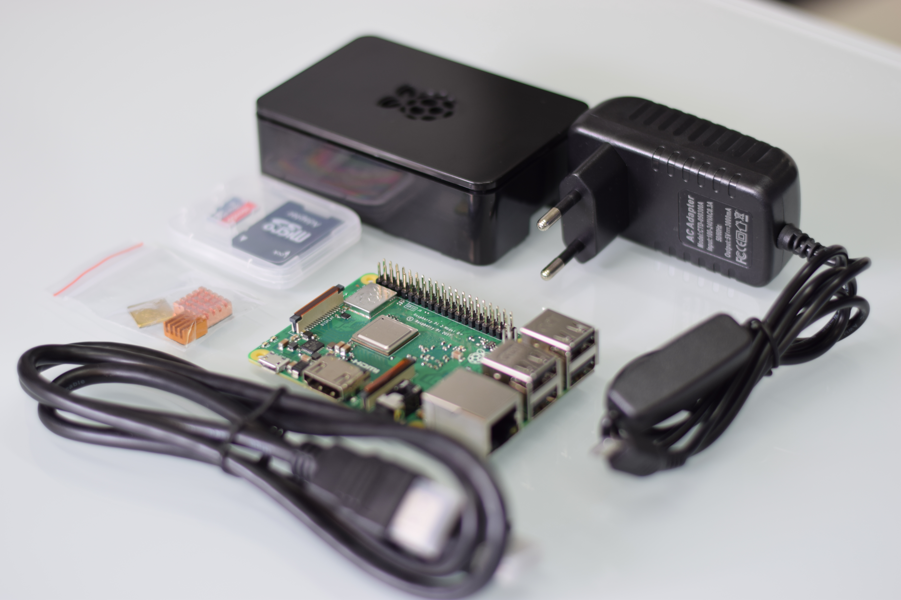
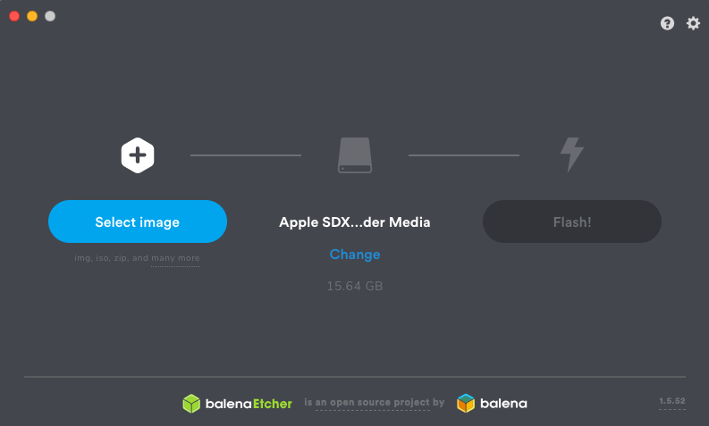
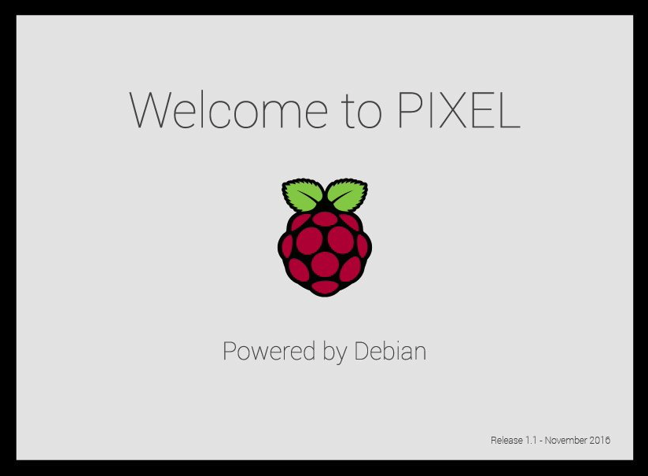

# Sklapamo Raspberry Pi i instaliramo Raspbian

## Instaliranje Rasbpian operativnog sistema

Raspbian je popularna distribucija Debian Linux operativnog sistema prilagođena Raspberry Pi računarima. Postoje dve popularne distribucije Raspbian-a Raspian Desktop - OS sa grafičkim okruženjem i Raspbian Lite - minimalistička verzija bez grafičkgog okruženja sa ciljem da zauzme što manje prostora na SD kartici. Mi ćemo se baviti instalacijom Rasbian Desktop operativnog sistema.

---

## Recept
* Raspberry Pi Model B+
* Micro SD kartica 8GB ili veća
* Napajanje
* HDMI kabal za povezivanje sa TV-om ili monitorom
* Kutija
* USB tastatura i miš

---

### Preuzimanje Raspian image-a

Raspbian ćemo preuzeti sa zvanične [Download stranice](https://www.raspberrypi.org/downloads/). Kada preuzmemo image fajl biće nam potreban i alat koji će raspakovati image na SD karticu. Za to ćemo koristiti Etcher koji možete naći na [sledećem linku](https://www.balena.io/etcher/)

### Instalacija na SD karticu

**Napomena o tipu SD kartice.** Često možemo pronaći na internetu informaciju da za Raspbian je preporučljivo koristiti SD karticu klase 10 ili bolje. Nažalost klasa SD kartice nije uvek garancija brzine, tako da treba se držati renomiranih proizvođača koji garantuju brzinu čitanja i upisa.

Za raspakivanje Raspbian image-a koristimo Etcher. Etcher je lak za korišćenje i radi na više platformi tako da se može koristiti na Windows, Linux i MacOS računatima.

Kako bi raspakovali Rasbian na SD karticu treba uraditi sledeće:
1. Preuzmite [Etcher](https://www.balena.io/etcher/) i instalirajte ga
2. Ubacite SD karticu u čitač
3. Pokrenite Etcher i pronađite image fajl od Raspbiana koji ste preuzeli
4. Odaberite vašu SD karticu i kliknite na Flash

Nakon nekoliko minuta Etcher će pripremiti SD karticu i raspakovati Raspbian.

Kada Etcher završi kopiranje fajlova SD karticu možete izvaditi iz čitača. Ubacite karticu u Raspberry Pi , priključite monitor ili TV, miša i tastaturu. Priključite napajanje.

Nakon nekoliko sekundi pojaviće se Rasbian ekran dobrodošlice. Sačekajte nekoliko minuta da se operativni sistem pripremi za prvo pokretanje.

Čestitamo uspešno se instalirali Raspbian!

Raspian dolazi sa mnoštvom preinstaliranih aplikacija. O samim aplikacijama govorićemo opširnije u posebnim tutorijalima.
