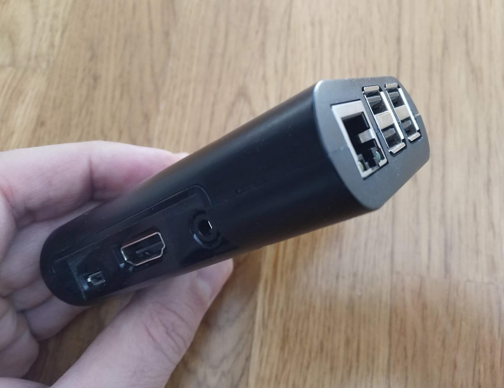
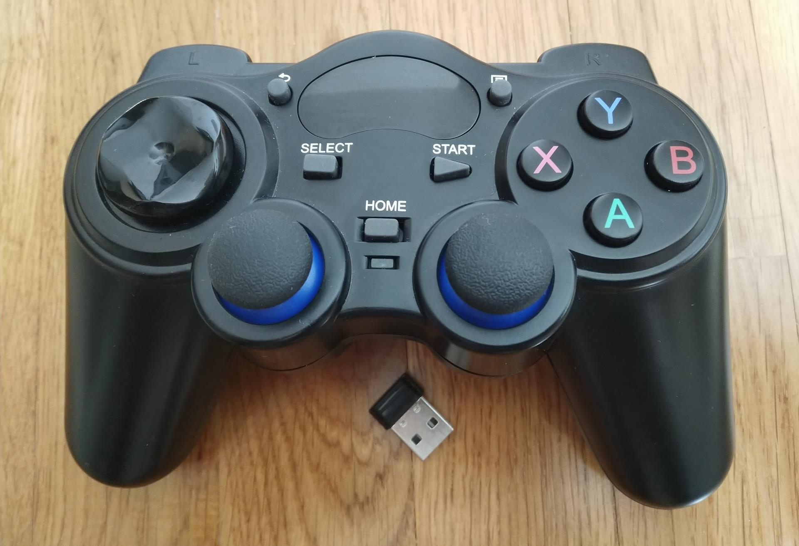
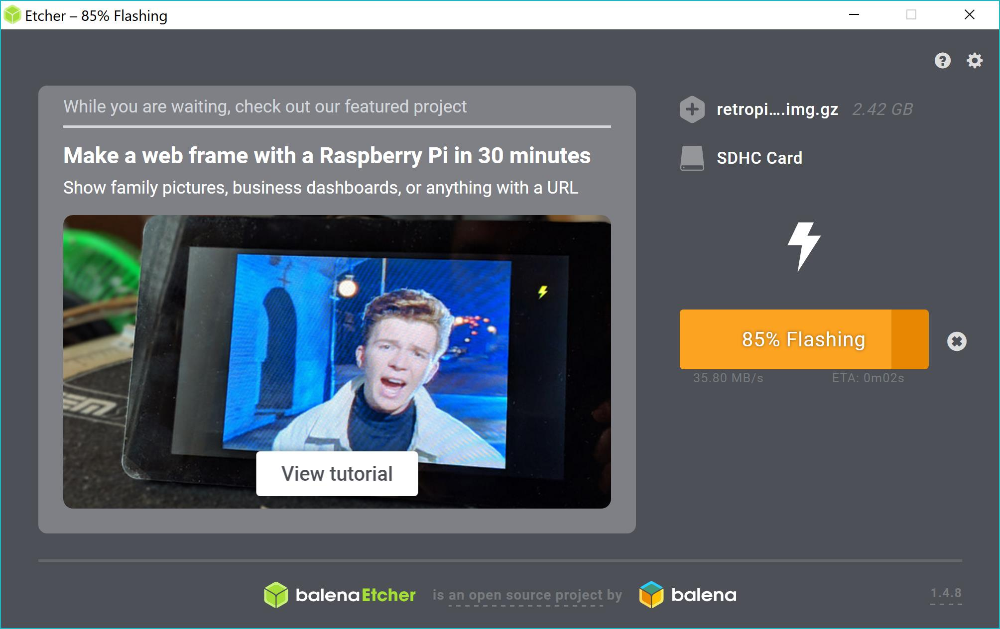
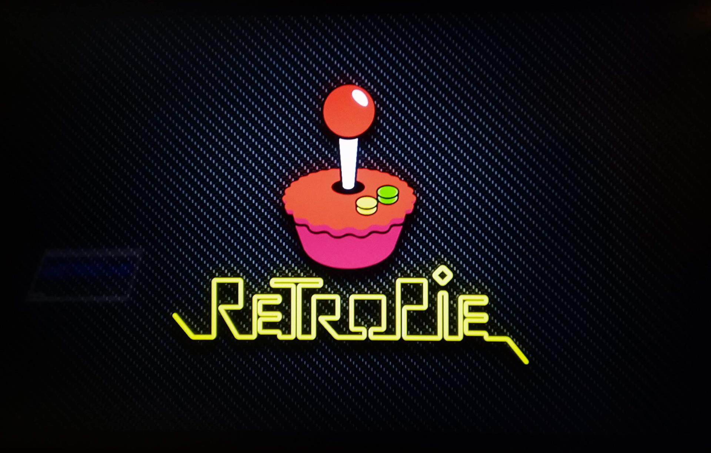
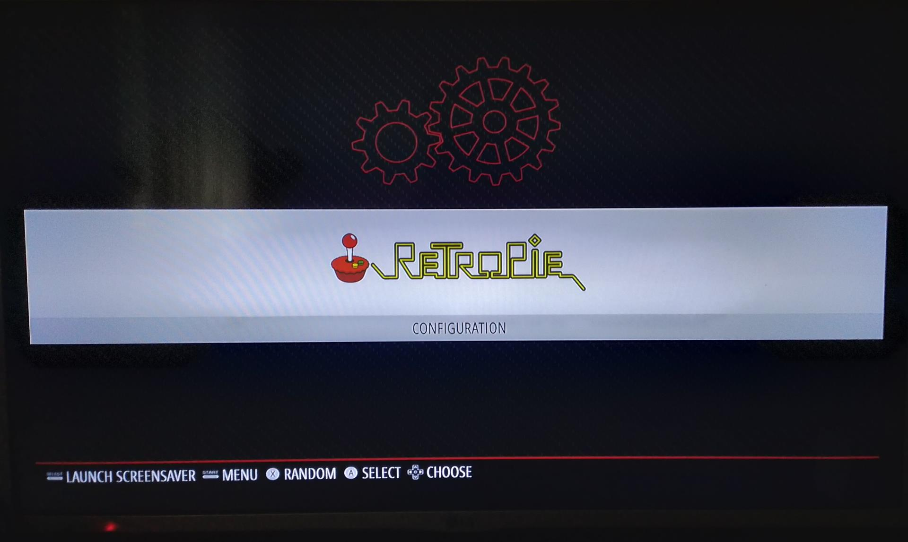
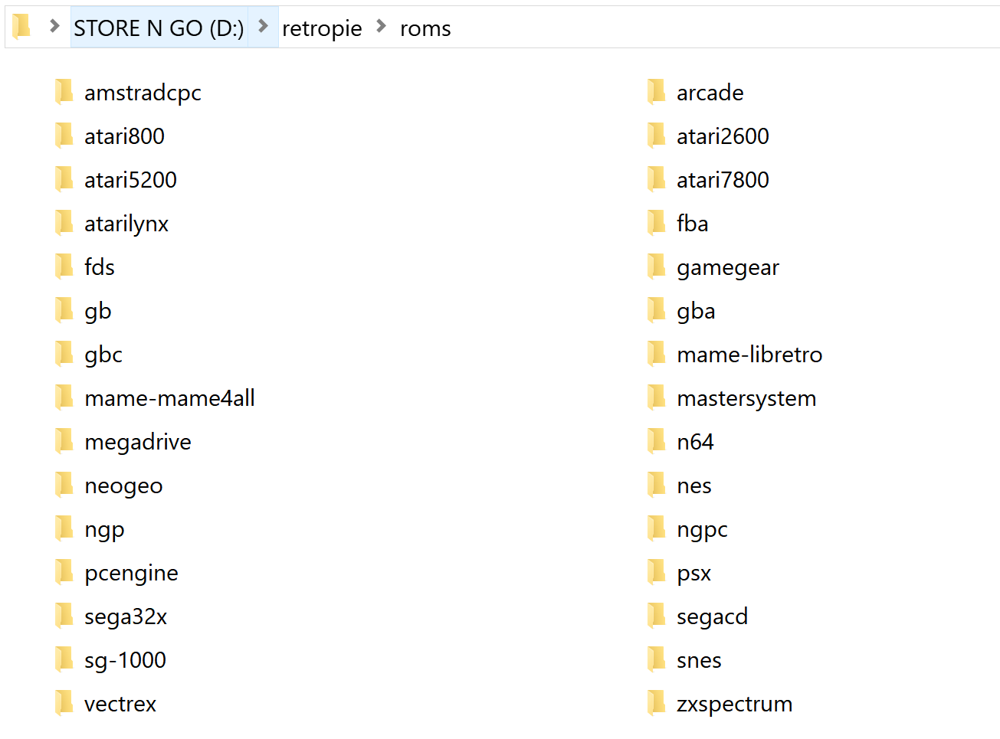
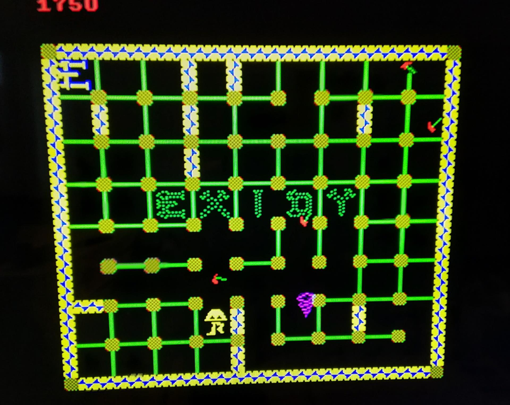
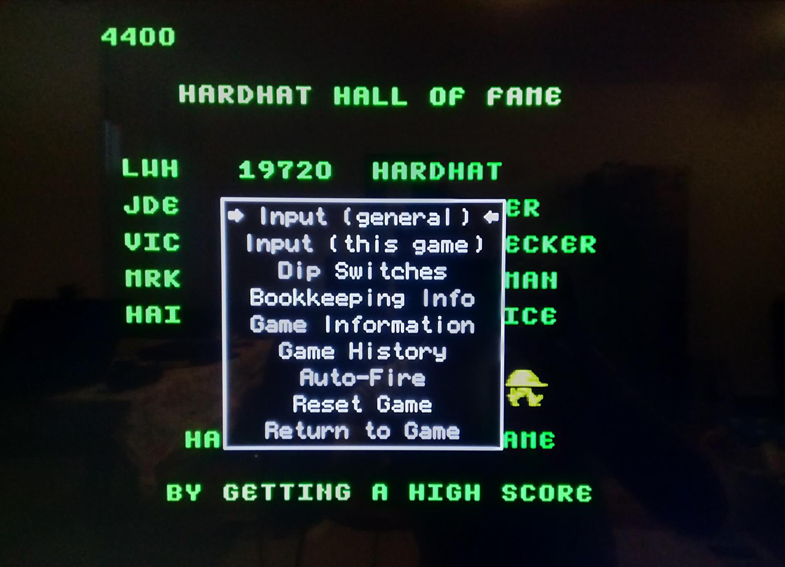
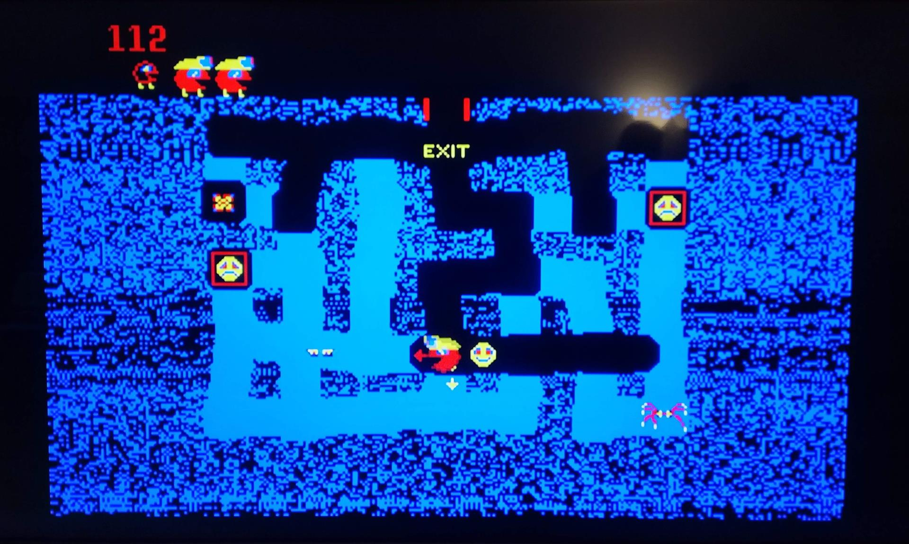

# RetroPie

## Zašto
Želimo da prvi projekti budu interesantni što široj publici, kako kolegama koji će nam se pridružiti u daljem razvoju ideje, tako i deci. Izbor je brzo pao na video igre, a kada govorimo o igranju na Raspberry Pi, standard je RetroPie.

## Šta
### Retro Pie
[Retro Pie](https://retropie.org.uk/) je interesantan projekat koji omogućava da vaš Raspberry Pi ili PC pretvorite u retro igračku mašinu. Lista podržanih platformi je duga, od meni omiljenih mikroračunara iz osamdesetih kao što je ZX Spectrum do konzola iz 2000-ih godina, kao što su Playstation 2 i Nintndo Wii. Izgleda da ćemo se dobro zabaviti, da krenemo redom.

## Kako

### Hardwer
Potreban nam je Raspberry Pi komplet i kontroler, ili još bolje par kontrolera. Koristiću već sklopljeni Raspberry i novu SD karticu, RetroPie staje i na 8GB, međutim ako želite da prebacite više igara birajte veću karticu, korišćena je kartica od 32GB.

Generalno možete koristiti bilo koji USB gamepad koji je kompatibilan sa Raspberry Pie. Izbor je pao na kontroler sa aliexpresa, sličan Sony PlayStation DualShock bežičnom kontroleru. Nemam puno iskustva sa kontrolerima, ali par ovih je meni i sinu prvaku sasvim ispunio očekivanja, evo kako izgleda:

Retro Pie se može instalirati preko postojećeg Raspbijana ili od nule. Odlučio sam se za instalaciju od nule, zvanično uputstvo za instalaciju možete naći na adresi https://retropie.org.uk/docs/First-Installation/.

### Instalacija sistema na SD karticu
Potrebno je skinuti retro pie image i program za kopiranje na SD karticu, izabrao sam [Etcher](https://www.balena.io/etcher/). Posle nekoliko minuta oba downloada su bila gotova, retro pie verzja 4.4 image od 684MB i balena etcher setup od nepunih 67MB. Posle instalacije etcher-a, potrebno je izabrati retro pie image fajl i izabrati disk, odnosno SD karticu na koju će image biti raspakovan. Cela operacija, uključujući i 5 do 10 minuta čitanja uputstva na retro pie sajtu je trajala oko pola sata.

### Startovanje i setovanje kontrolera
Ubacite pripremljenu SD karticu u Vaš Raspberry Pie i priključite kontrolere. Posle pokretanja, Raspberry Pie će prikazati dialog za konfigurisanje kontrolera. Dovoljno je da pratite tekst na ekranu i izaberete odgovarajuće komande sa Vašeg kontrolera. Posle toga RetroPie je spreman za upotrebu, osim što na njemu nema ni jedne igre!

### Igre
Prvi izazov je pronaći ROM-ove, fajlove koji sadrže igre, koje su besplatne. Video igre su relativno nova stvar, tako da copyright čak i za najstarije video igre nije istekao. Nintendo na svom [sajtu](https://www.nintendo.com/corp/legal.jsp) tvrdi da je copyright u USA 75 godina od datuma objavljivanja. Na sreću ima autora koji su dozvolili besplatnu upotrebu svojih igara za nekomercijalne svrhe, neke od njih možete naći na ovoj [adresi](https://www.mamedev.org/roms/).

Pošto smo izabrali igre i skinuli ROM-ove, sledeći korak je prebacivanje ROM-ova na uređaj. Postoji više načina da se ovo uradi, najjednostavniji je pomoću USB memorije. Idealno je ako USB memorija koju koristite ima svetlosni indikator ali nije neophodno. Formatirajmo USB memoriju sa FAT32 fajl sistemom i napravimo folder *retropie*. Sada USB memoriju ubacite u Raspberry Pie i sačekajte nekoliko minuta, ukoliko memorija ima svetlosni indikator dovoljno je sačekati da prestane da svetli. RetroPie će na USB memoriju u folderu retropie koji smo napravili generisati strukturu podfoldera u koje možemo da iskopiramo ROM-ove koje želimo.

Izabrao sam dve igre sa sajta mamedev.org Hard Hat i Robby Roto.

Zipove kopiram na USB memoriju u folder *\retropie\roms\mame-mame4all*. Zatim vraćam USB u Raspberry PI.

Iz glavnog menija *Main menu* izaberite komandu *QUIT*, a zatim *Restart emulation set*. RetroPie će iskopirati sve ROM-ove sa USB memorije i pojaviće se svi emulatori na kojima su prepoznate igre. Posle ovog koraka USB memorije nije više neophodna, dok ne poželite da dodate nove igre.

Posle restarta pojavljuje se Mame emulator i igre se uspešno pokreću. Sledeći izazov je kako početi igru jer su ROM-ovi sa arkada i neophodno je ubaciti žeton (Coin) da bi mogli zaista i da igramo pokrenutu igru. Podrazumevano dodavanje žetona je tasterom *6*, a izbor jednog ili dva igrača tasterima *1* i *2* redom.  Pretpostavljam da je moguće mapirati ove tastere na komande kontrolera, međutim odlučio sam da povežem tastaturu i iskoristim podrazumevane komande. Posle toga sam mogao da koristim kontroler bez problema u obe igre.

#### Hard Hat
Hard Hat je logička igra koju je dizajnirao Larry W. Hutcherson Sr. za Exide, objavljena je 1982. Glavni junak je stolar koji ima cilj da speluje “E-X-I-D-Y” ili “H-A-R-D-H-A-T” u lavirintu ukoliko ga pre toga ne sustigne neki od neprijateljski nastrojenih čekića ili tornada.

Tastatura se pokazala kao zgodna ispomoć jer taster *Tab* otvara sistemski dialog emulatora (GUI menu) iz kojeg možete podesiti *Input* ili restartovati igru.

Iz nekog razloga *Home* taster konrolera koji sam izabrao kao Hot key ne funkcioniše, tj. nisam mogao da izađem iz igre.

### Robby Roto
The Adventures of Robby Roto je igra čuvene [Jamie Fenton](https://en.wikipedia.org/wiki/Jamie_Fenton) i [Dave Nutting](https://en.wikipedia.org/wiki/Dave_Nutting)-a iz 1981. Glavni junak Robby probijajući se kroz lavirint ima cilj da oslobodi zatvorenike i spasi ih od paukolikih stvorenja.

---
**Recept**

Ukoliko imate sav potreban hardware i pristojnu internet konekciju, potrebno je manje od 2 sata za ceo projekat. Potrebni sastojci:

### Hardware
- Računar sa internet konekcijom, Balena Etcher podržava Windows, macOS i Linux
- Raspberry Pie komplet
- TV uređaj sa HDMI ulazom
- Gamepad i/ili tastatura*
- USB memorija za prebacivanje ROM-ova

\* Tastatura nije neophodna za igranje, međutim olakšava podešavanje sistema

### Software
- [Balena Etcher](https://www.balena.io/etcher/)
- [RetroPie image](https://retropie.org.uk/download/)
- ROM-ovi igara [mamedev.org](https://www.mamedev.org/roms/)
---

Želimo dobru zabavu!